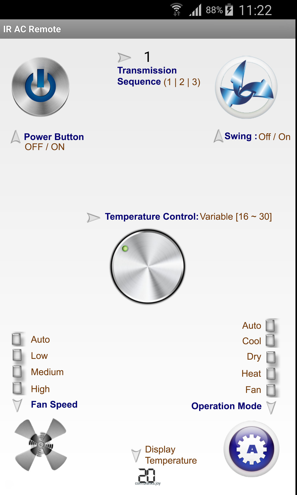
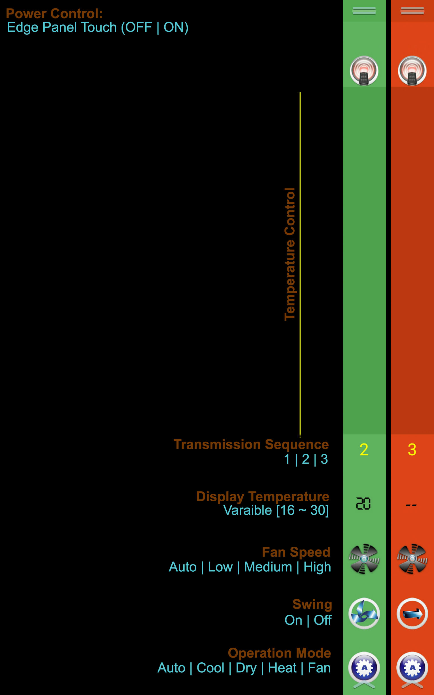

# IR-AC-Remote
Remote Controller to Air Conditioners for Android devices having Infrared port
<table>
	<tr>
		<td align=center>Main Application Remote</td>
		<td align=center>Samsung Edge Panel</td>
	</tr>
	<tr>
		<td>
			
		</td>
		<td>
	        
	    </td>
	</tr>
</table>

####Supported Devices:
1. HTC
2. Samsung

####Edge Support :
1. Samsung Note Edge


###Basic Code Example to transmit

```java
//get CONSUMER_IR_SERVICE service from context for Modern Devices
public static ConsumerIrManager getConsumerIRService(Context context){
    ConsumerIrManager consumerIrManager  =
            (ConsumerIrManager) context
                .getSystemService(android.content.Context.CONSUMER_IR_SERVICE);
    return consumerIrManager;
}
//get ConsumerIrManagerCompat service from context for HTC Devices
public static ConsumerIrManagerCompat getConsumerIrManagerCompat(Context context){
    ConsumerIrManagerCompat mCIR = ConsumerIrManagerCompat.createInstance(context);
    mCIR.start(); //for HTC - noop otherwise (also see onResume()/onPause() )
    return mCIR;
}
// The IR Data to transmit
public static void transmit(Context context, TransmissionCode data){
    if (Build.MANUFACTURER.equalsIgnoreCase("HTC")) {
        //TargetApi(19)
        ScaryUtil.getConsumerIrManagerCompat(context)
                .transmit(data.getFrequency(),data.getTransmissionPulses());
    } else {
        //TargetApi(21+)
        ScaryUtil.getConsumerIRService(context)
                .transmit(data.getFrequency(),data.getTransmission());
    }
}
```


### Getting the Transmission Code from Raw pulses

```java
TransmissionCode data = new TransmissionCode(38028, "123,339,23 . . . . .3,53,23,2500");

/**
 * TransmissionCode :: getTransmissionPulses()
 * other fallbacks for vendor IR APIs using the pulses targetting API 19
*/
public int[] getTransmissionPulses() {
    String[] countArray = this.transmission.split(",");
    int[] intTransmission = new int[countArray.length];
    for (int i = 0; i < countArray.length; i++) {
        intTransmission[i] = Integer.parseInt(countArray[i]);
    }
    return intTransmission;
}

/**
 * TransmissionCode :: getTransmission()
 * Samsung/Modern phones will use API 21 to transmit which says duration in microsecs
 *
*/
public int[] getTransmission(){
    int pulses = 1000000/this.frequency;
    String[] countArray = this.transmission.split(",");
    int[] anotherFix = new int[countArray.length];
    for (int i = 0; i < countArray.length; i++) {
        anotherFix[i] = Integer.parseInt(countArray[i]) * pulses;
    }
    return anotherFix;
}
```

<hr/>
### &lt;receiver&gt; tag for the Samsung EDGE panel in AndroidManifest.xml
```xml

<receiver android:name=".main.RemoteEdgeProvider" >
    <intent-filter>
        <action android:name="com.samsung.android.cocktail.action.COCKTAIL_UPDATE" />
    </intent-filter>

    <meta-data
        android:name="com.samsung.android.cocktail.provider"
        android:resource="@xml/remote_edge" />
</receiver>

```

####The SlookProvider SDK from Samsung supports these methods overridden in your provider implementation

```java
package com.samsung.android.sdk.look.cocktailbar;

public class SlookCocktailProvider extends BroadcastReceiver {
    private static final java.lang.String TAG = "SlookCocktail";
    public SlookCocktailProvider() {
        /* compiled code */
    }
    public void onReceive(Context context, Intent intent) {
        /* compiled code */
    }
    public void onUpdate(Context context, SlookCocktailManager cocktailManager, int[] cocktailIds) {
        /* compiled code */
    }
    public void onEnabled(Context context) {
        /* compiled code */
    }
    public void onDisabled(Context context) {
        /* compiled code */
    }
    public void onVisibilityChanged(Context context, int cocktailId, int visibility) {
        /* compiled code */
    }
    private void insertLogForAPI(Context context, String apiName) {
        /* compiled code */
    }
}
```


If you are using this please provide my name reference in your app credits. This was an experimental project, Please feel free to log issues in the tracker.


## IR-AC-Remote
####by Joy Biswas @ joy.blanks@hotmail.com
